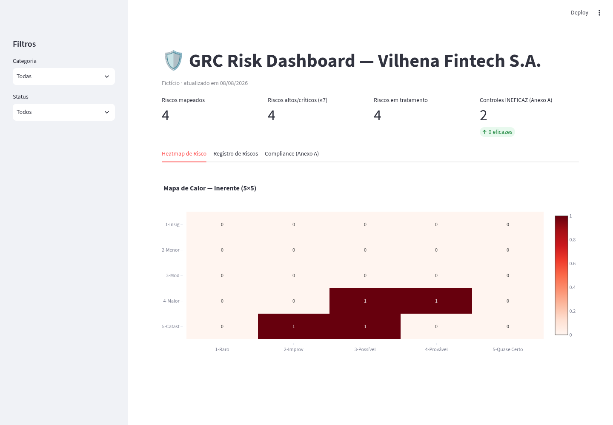

# Portfólio GRC — Vilhena Fintech S.A. (Fictício)

Portfólio prático de **Governança, Riscos e Compliance (GRC)** aplicado a uma empresa fictícia (Vilhena Fintech S.A.). Todos os dados são ilustrativos; os scripts são executáveis e reproduzíveis.

## Visão geral
```
GRC/
├── 01-control-testing/          Matriz de 20 controles ISO 27001:2022 testados
├── 02-risk-dashboard/           Dashboard Streamlit (heatmap, KPIs, abas)
├── 03-compliance-as-code/       Verificação automatizada de controles + CI
├── 04-tprm/                     Questionário e tiers de risco de terceiros
├── 05-evidencias/               Modelo de evidência de auditoria
└── .github/workflows/ci.yml     Pipeline que falha quando um controle é INEFICAZ
```

## O que cada módulo demonstra
| Módulo | Demonstra |
|--------|-----------|
| Control Testing | Priorização de testes por controle, dono, frequência e plano de tratamento |
| Risk Dashboard | Análise de risco inerente (5×5), KPIs executivos e visualização interativa |
| Compliance as Code | Segurança como código: evidências versionadas, CI falhando em INEFICAZ e relatório JSON |
| TPRM | Due diligence de fornecedores com scoring ponderado e tiers de risco |
| Evidências | Padrão de documentação auditável (método → achado → tratamento) |

## Como rodar
```bash
# 1. Compliance-as-code (gera relatorio_controles.json, exit 1 se INEFICAZ)
cd 03-compliance-as-code && pip install -r requirements.txt && python check_controls.py

# 2. Dashboard (abre a aba Compliance com o relatório gerado)
cd ../02-risk-dashboard && pip install -r requirements.txt && streamlit run app.py
```

## Screenshot do dashboard


## Foco do candidato
Este portfólio mostra a operação de um programa GRC completo na prática:
- **Operacional:** testes de controle executados e evidenciados.
- **Analítico:** leitura do risco inerente e residual a partir do registro.
- **Técnico:** automação do compliance com Python, JSON e CI/CD — o ciclo de auditoria reduzido de semanas para minutos.
- **Documental:** rastreabilidade entre evidência, achado, status e plano de tratamento.

---
*© 2026 — Conteúdo fictício, criado exclusivamente para fins de portfólio profissional.*
